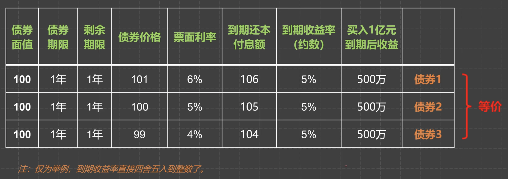
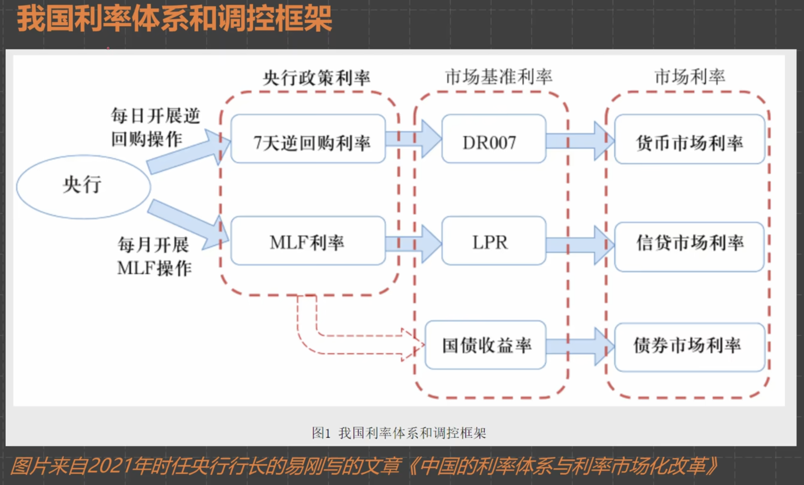
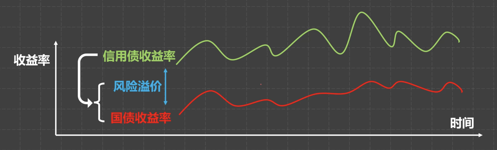

# 债券

## 概念

### 基本概念

> A用100元在发行人那里购买了一张债券，1年后得到100元本金和6元利息

那么债券的 **发行价格** 为100，**债券期限** 为1年，**债券面值** 为100元，**票面利率** 为6%

### 到期收益率

> A可以在1年后得到本金利息，也可以选择在二级市场交易
例如B在二级市场花101元购买了这张债券，虽然1年后能得到的利息也是6元，但因为购买的价格高，因此最终的收益率并没有6%

**((债券面值 + 利息) / 债券价格) - 1 = 到期收益率**

((100 + 6) / 101) - 1 ≈ 5%

### 票面利率 & 到期收益率

- 票面利率是发行时规定的，是指名义上持有债券每年获得利息的比率
- 到期收益率则是二级市场中交易时根据债券价格、债券面值、票面利率计算得出，是通常我们的真实持有到期收益率

### 债券价格 & 收益率

由以上公式变形可得出

**债券价格 = (债券面值 + 利息) / (到期收益率 + 1)**

即债券价格和到期收益率成反比，很好理解：买债券的时候价格越低，最终获得的本金+利息才会越高

**到期收益率才是债券最本质最核心的指标**

### 国债收益率

- 利率债：国债、地方债、政策性金融债等几乎无违约风险的债
- 信用债：企业债、公司债、短期融资券等有一定违约风险的债

信用债的违约风险较高因此收益也相对较高，信用债的收益率跟国债收益率也有相关关系：

信用债收益率 = 无风险收益率(国债收益率) + 风险溢价

